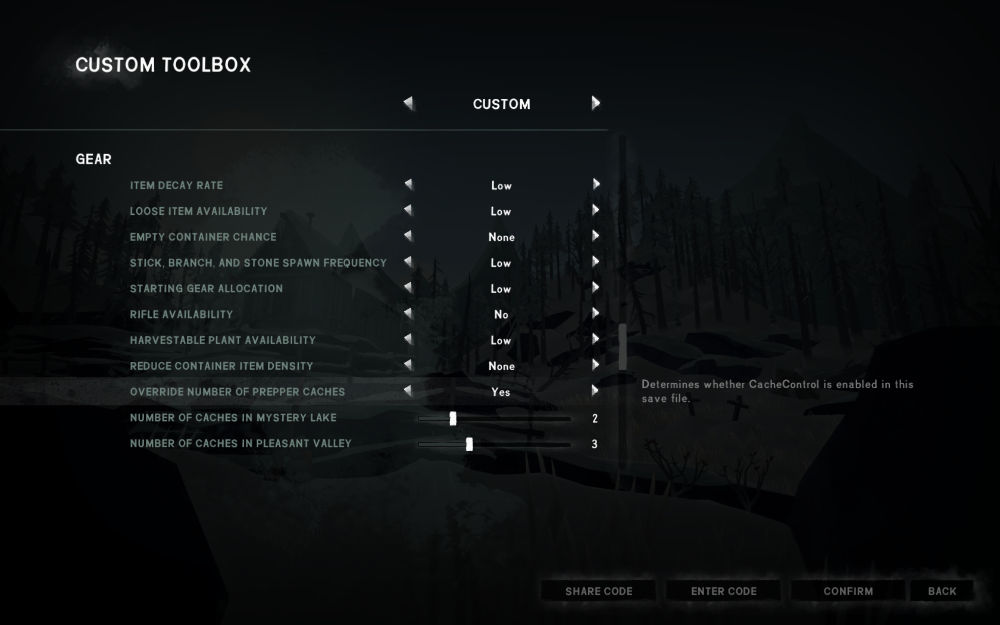

# CacheControl

A mod for The Long Dark that lets you decide how many Prepper Caches spawn in custom mode games.

*This mod also includes a command to activate a number of randomly chosen caches in existing save files, see below.*

## Installation

1. If you haven't done so already, install MelonLoader by downloading and running [MelonLoader.Installer.exe](https://github.com/HerpDerpinstine/MelonLoader/releases/latest/download/MelonLoader.Installer.exe)
2. If you haven't done so already, install [ModSettings](https://github.com/zeobviouslyfakeacc/ModSettings) v1.6 or newer
3. Download the latest version of `CacheControl.dll` from the [releases page](https://github.com/zeobviouslyfakeacc/CacheControl/releases)
4. Move `CacheControl.dll` into the Mods folder in your TLD install directory

Alternatively, you can download `CacheControl_with_ModSettings.zip` and extract it into your Mods directory.

## Instructions

1. Start a custom mode game:

   
2. Scroll down to the 'Gear' section and set 'Override number of prepper caches' to 'Yes'

   
3. Select how many caches you want to spawn in Mystery Lake and Pleasant Valley by dragging the sliders
4. Start the game and find these caches!

## Using this mod in existing and non-custom games

As this mod adds new custom mode settings, it won't work in existing and/or non-custom games.

However, the mod also adds a console command, `force_reroll_caches`, that can be used to enable more prepper caches in old games.
To use such commands, you'll need a mod with a console such as [FINDarkside's Developer-Console](https://github.com/FINDarkside/TLD-Developer-Console/releases) mod.

To use the command, load your old game, travel to either Mystery Lake or Pleasant Valley and open the console.

Then, run the command `force_reroll_caches n`, where `n` is the (positive) number of caches you want to spawn.  
This will first disable all caches and then choose `n` possible cache spawn locations to activate.

In other words, it's possible to lose access to caches you've already discovered, so be careful when using this command.
